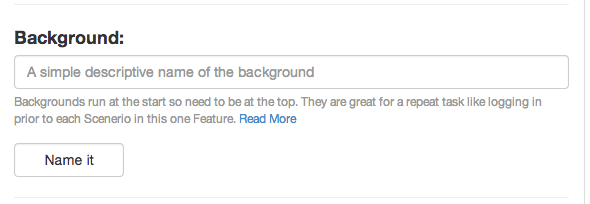

##Background



A test can have a Background (just one). This will run before each Scenario. 

This is a good place to do logins, logouts etc.

There are some custom steps you can apply here and some drush integration

```
Feature: Your Overall Test name like User Interaction

  Scenario: User Edits a page
  Scenario: User Deletes a page
  
```


A scenario can have tags (more on tags)[http://alnutile.github.io/behat_editor/tags.html] 

So then this would be tagged @javascript, note this only applies to the one Scenario.


```
Feature: Your Overall Test name like User Interaction

  @javascript
  Scenario: User Edits a page
  
  Scenario: User Deletes a page
  
```


More Reading

[docs.behat.org](http://docs.behat.org/guides/1.gherkin.html#backgrounds)

[drush and behat](drush.html)


