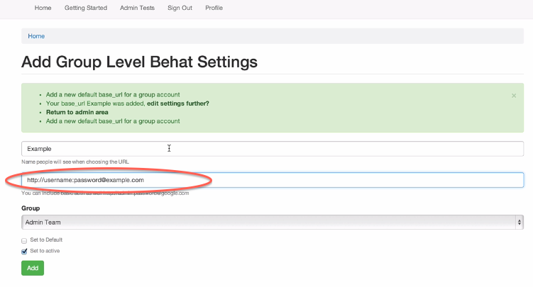

#Basic Authentication 

You can see a videos in these places to see how to set this up

 * [URLs Settings](http://www.youtube.com/watch?v=DiQ0AihBkzQ)
 * [URL Usage](http://www.youtube.com/watch?v=qjw7FS4afQM)
 * [URL Usage 2](http://www.youtube.com/watch?v=pEBKsVhFqWU)
 * [Basic Auth Settings](http://www.youtube.com/watch?v=Lr9QMnfTpPc)
 

Once you are in the admin URL interface (click Behat URL Settings) and click Edit or add new. 

Make sure that you are in the "Behat URL Settings by Group" if this URL is for your group and not just you.

 * Basic authentication can be entered in the url for now

 * If you had a basic authentication that needed to be done enter the following information for that user

 		http://username:password @ example.com 
 		
#####(See Image Below)
--

###That will authenticate you

--

**Note**

* If the password has an @ sign in it you would have to replace it with the proper encoding/decoding.

* This does not work well with internet explorer but we are working on that    