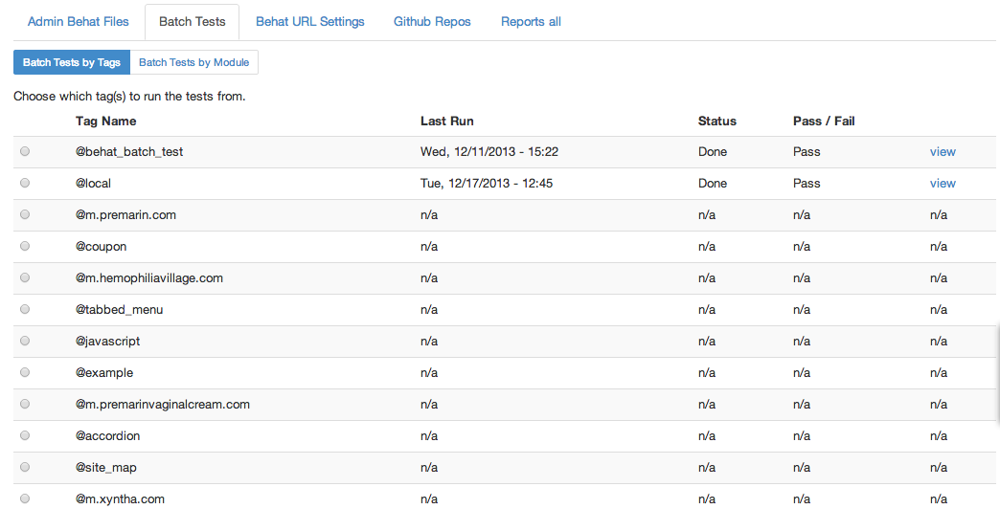

### 

You can see a video here as well

[Video](http://youtu.be/jciu9N6Q8-0)

Tests can be run in Batches

You can visit Batch Tests from the Admin page.

  * Choose your Tag to run
  * Choose your URL 
  * Choose your Browser or OS
  * Execute and wait, wait, wait
  

Now it will run one test for each file with that @tag and report back to you in a few minutes.

