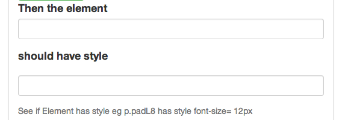

##Checks the Style of an element

This can be handy for checking a font size change after clicking a font size changing helper/link.

Then you could target the element before and after the click to make sure the size is changing, in this case based on the style the class is receiving.

