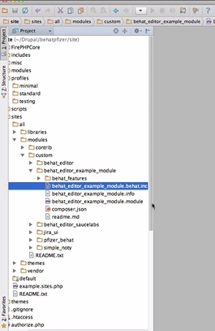
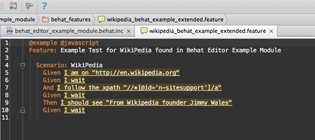
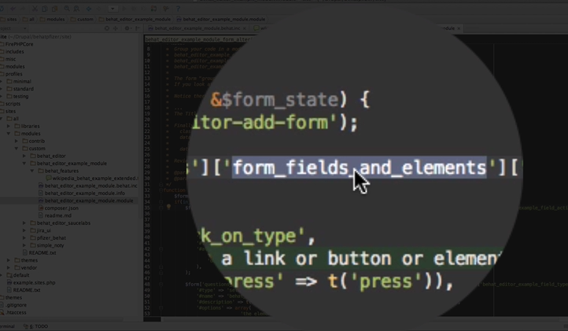
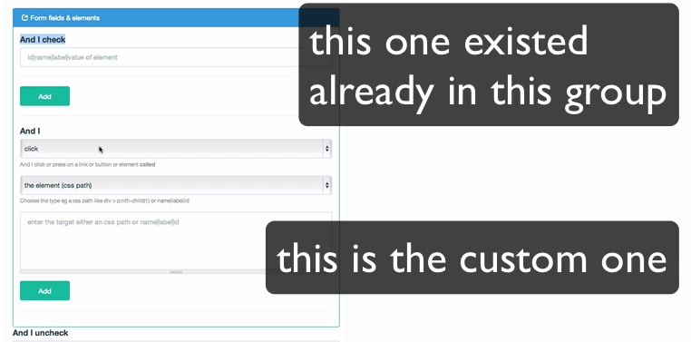

#Introduction to Custom Module: Overview to Extending Behat Editor

You can see the related video here

[Intro to a custom module](http://www.youtube.com/watch?v=_snyCI3mJvI)

######How to use the example module and start working on things 
-
####Here you can find:
* How to put your tests inside of a custom module
* Write your own features
* Custom Step definitions
* How to add form elements to the form UI
* Github Integration 

--

######***The benefit of this module is that it allows you to write your own sub contexts and then add them to the form that behat uses to do tests, create tests, and collect all your tests inside of a folder.*** 

	Important: You have to have your custom steps in place as needed
-
 
#####Depending on what your team is doing you might not need to add them to the form. 
######If you do - this is how:  

&rarr; Once you download this module it will then go through composure manager to start building the needed composure libraries 

		There is only a couple things going on in this module. 
1. A form alter to alter the UI 
2. It also has the Behat Inc file (see image below)

		NOTE: This is the file that the druple extension module looks for to then pull in your sub context custom steps
 

So in this case you could add a couple 
* Press the x path and followed the x path

--
		Why would you do this? 

			* If they did not initially exist in a way that worked.

		    * Or this was something you needed that did not already exist.

#####In these cases you will have to write them.

 
* Once you write them here you can use them in your test

* In this case all of the tests will live in the Behat feature folder.  

**Here is an example of the test using those particular steps** 

* Click the X path
* Follow the X path 

		Now any test inside your behat features folder will be seen and you can run it 
***It has to be in that folder it can not be in a subfolder right now***

-
	You can use all of our existing steps of course but if you need any custom ones you would put them in the behat inc folder. 

####If you want those steps to show up in the graphical interface that you have in the form:
-

&rarr; you would then start building your form alter to make those steps show up in the form.

&rarr; Add your steps to the particular grouping category
 
&rarr; Start making the form fields needed to make those steps work

	There are a number of elements of the form to make it work right with the javascript. 

	
	Ideally the code and the numbers that come with the code will help you read it. 
Some of these codes are: 

* The 'AND I' title 
* The select list with the values
* As well as the grouping of these elements with the group class 

		Those grouping elements help the final add button trigger the javascript to grab the right text and the right values and to create the graphical scenario builder and we will look at that in a moment.

	######If you visit the scenario builder you will see that the form alter that this module created is now inside of the 'questions area', 'questions', 'questions', 'form field', 'form fields', and 'elements'.
		**That is what makes up the group**
* There is a handful of them that you will discover and will make clear to put them in. 

-

 
* The group here then helped this group that was made custom to show up with a group that already existed

- Now you have your particular custom step

-
	You should now be able to see that you have your 'AND I' and 'your select options' as well as your next set of select options (which doesn't have a title because you are not adding any text other than the "select value" and finally the field that they are filling in and then the add button.
 

#####NOTE: It might take a while to get use to the layout 

######Another thing to keep in mind is that all of these form elements come from the behat editor form file. And right now it is in this oddly named behat shared views and you can see the form here and start grabbing ideas here on how the other formats were built. 

So now if I was to put AND I press : we will just use : CSS path for a moment we will just say : Test1 p for example 

There are so many different ways to do it but we will just use that and I press the element DIVtest 1. Since it is not a link we can't follow it or link it we press it

and thats it now your step will pass. 

	And again if you didn't add it to the UI no big deal because in your case you might just be uploading your test 

####UPLOADING YOUR TEST

* Go back to the admin interface

* Notice here that all the tests have a module folder

* If you look for your test "behat_editor" you will see that there is the example module folder and all the tests in that folder will have their own lines here. This way you can quickly search for your test. 

		You will not be able to edit or delete it, because you are managing it in your folder for your module. However, you can view it and run it. 

* When you go back to your code you have a chance to add more tests to your behat features folder and then upload them. 

		We will have a jenkins server setup so that when you upload a new test to your branch in your repositories it will then automatically push it to your site so that you will then see it within a moment or two. 

---

######NOTE:	
#####* You are more then welcome to use the UI and create a test here, save it, and then in a moment you will get a link to the test so you can just download it. 

---

**To Do This:**

* Download to your behat features folder in your module
* Upload via github
* Now its yours and its in a place your team can share 
* Then delete it from the other folder just so no one gets confused. 
