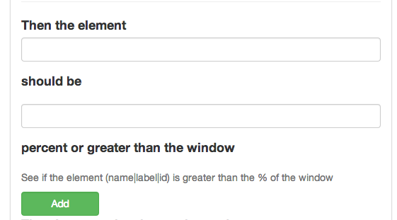
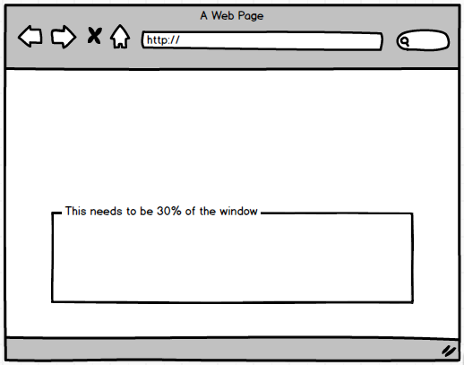

##Element Size

This step will help verify size of the element in % compared to the window.

	
So if this is the page you where testing

Then the %30 div would be your focus

You would use the jquery / dom path of the element you want to get the size of.

So the test would look like this

	Feature: Test Content Sizes
	  Scenario: Test the Content is 30% of the window
	    Given I am on "http://saucelabs.com/test/guinea-pig"
	    Then the element "div#target" should be "30" percent or greater than the window
	    

