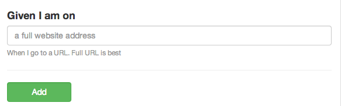

## Given URL Step

A test needs to go to a url. Each Scenario can have a Given line

	Feature: Your Overall Test name like User Interaction

  	  @javascript
  	  Scenario: User Edits a page
  	    Given I am on "/contact_us"

The above would then visit /contact_us before running the step's tests.

You could also include it in the background.

	Feature: Your Overall Test name like User Interaction

  	  Background: Setup the Test
  	    Given I am on "/contact_us"
  	    
  	  @javascript
  	  Scenario: User Edits a page
	    Then I should see "Contact Us"

The URLs should be relative so you can run a test against the Production, Staging and other URLs as needed using 1 test.

## More Reading

[docs.behat.org](http://docs.behat.org/guides/1.gherkin.html#givens)

