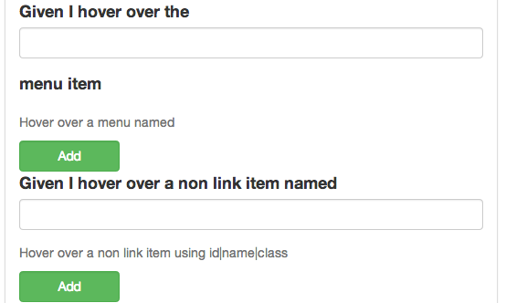

##Hover

If you need to hover over an menu item or a non-menu item (eg not a link/href) then this will help you target those.

Note right now it is limited to name|id|label

See [Targets](target.html) for more info