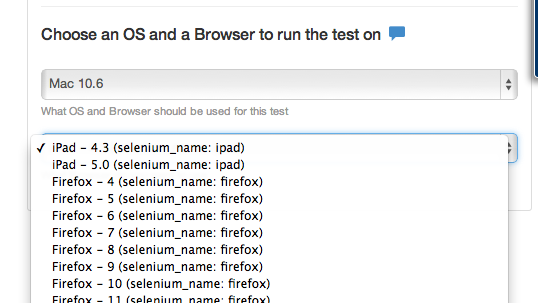

## Mobile

You can see a video here on using mobile.
[Mobile Video](http://youtu.be/2GIwbBUPu5o)

If Saucelabs is enabled then you will have more choices in the menu.

## iOS 

Choose Mac and then iPhone or iPad. Best to use the latest iOS version or one behind since Apple tends to no cover the browser further back than that.

## Android

Choose Linux then Android

