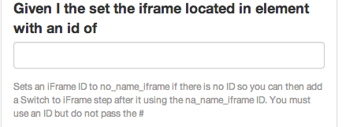

## No name Iframe

Sometimes an Iframe does not have a name or ID to target. This step will help you target it based on a surrounding div.

For example

	
 
	  
	    <iframe>
	    

Would allow you to target div#here to get to the Iframe

See [Switch to Iframe](iframe_named.html) when you are lucky enough to have a decent Iframe.