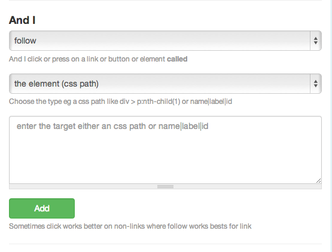

## Follow/Press/Click

This collection of boxes helps to deal with different combinations of elements.

####Step 1

#####Follow

This is how you typically would "Follow" a link eg click and go to that page. This works well for a default.

#####Click

Sometimes Follow will not work due to Javascript or cause the element really is not a link but a list element that is being treated like a link for example.

#####Press

This is mainly for buttons

***

####Step 2

Choose the type of target

#####Element (css path)

For example div.test a.test_link would target that css path

#####Name|Label|ID

If you are lucky to be working with good HTML you can use just the name or label or ID of the link to follow or press. Keep in mind if you use the link text eg "Click Here" that it is not repeated on the page as a link.

#####Xpath

Finally you can always use Xpath but keep in mind to replace quotes with single quotes. So

	//*[@id="edit-behat-editor-example-field-type"]
	
Would become
	//*[@id='edit-behat-editor-example-field-type']

Chrome has this built in. So if you right click and Inspect the element then go down to the Console and click there you can get it. 

