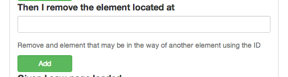

##Remove Element

Behat is about testing the site as the user would experience the site. BUT sometimes things get in the way. This is a the shotgun approach to those moments. For example one screen we had to deal with would not let us scroll past an element so we could click on the form submit. A user could do it but Mink/Behat could not.

So by using a jQuery dom path we could remove that element.

	div.class_name > span 
	
And it is gone.

