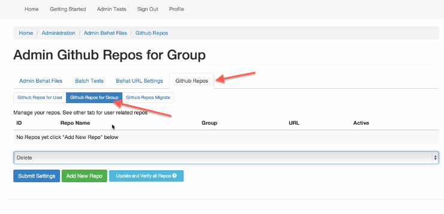
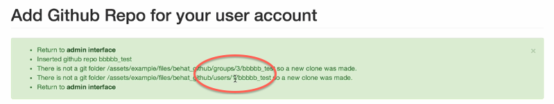

#Repositories Setup
-
 **Now that you have the URLs in groups you can start setting up your repositories**
___

**You can see a video about this [here](http://www.youtube.com/watch?v=f3ko6E3DB0s)**

## Repo Setup "Where should I place my tests"

your repo should have a folder called tests
In there will be a folder called behat. Place your tests in there.

This folder may later have unit test, functional tests etc so we are adding the behat folder for your test.feature files.

##*This module comes with a github module so that you can connect to the API*
-

&rarr; Go to the admin index

&rarr; Find the 'Github API setting

&rarr; Click on Github API link 

&rarr; To access enter your Github user name and password
 
&rarr; Click on the Admin Github Repos for Group tab

####*Here is where you would start setting up the repos for your group*
 
&rarr; Click on the Github Repos in the Github Repos for Group Section
 
&rarr; Click on Add new Repo
 
&rarr; Choose the repo you would want to clone locally

&rarr; Assign it to a group and choose which folder those tests are in and then click ADD 

#####*NOTE: That folder should exist prior to using the repository*

 
	This will download that repo for all users in that group as well as the group

It will show you the path it created for the group and users of the group
* The first path will contain a number which is the group ID number 
* The second path will also contain a number which is the number of users in the group who have access to the repo (See Image Below)

Finally when you go back to admin test and search for the folder name you will see that repo in place under module/folder and here all the tests that are in that folder will be viewable. 

  

 
	