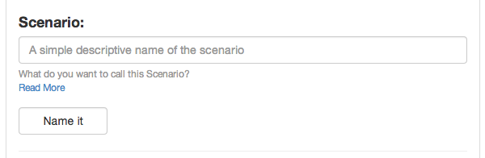

##Scenario

All test must have one Scenario at least but can have more. This is a how a test will typically layout.

A Scenario will summarize that Step in the test.

	Feature: Your Overall Test name like User Interaction

  	  Scenario: User Edits a page
  	  Scenario: User Deletes a page

A scenario can have tags (more on tags)[http://alnutile.github.io/behat_editor/tags.html] 

So then this would be tagged @javascript, note this only applies to the one Scenario.

	Feature: Your Overall Test name like User Interaction

  	  @javascript
  	  Scenario: User Edits a page
  
  	  Scenario: User Deletes a page

More Reading

[docs.behat.org](http://docs.behat.org/guides/1.gherkin.html#scenarios)

