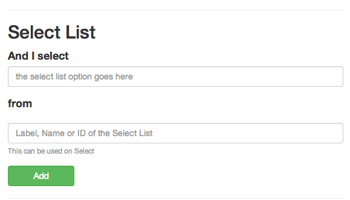
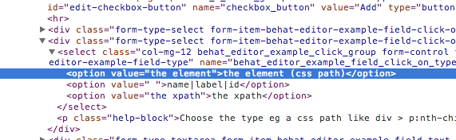

##Select Lists

Use this step to help select an option in a list.

"And I select" would be the value of the option you want to select.
As seen here it would be "the element" and not "the element (css path)

###Not all Select Lists are just that

Keep in mind if you look at the source a select list will always look like this

	<select>
	  <option value='1'>1</option>
	  <option value='2'>2</option>
	</select>
	

Some times it will look like a select list but really be a list like this

	<ul>
	  <li>Name 1</li>
	  <li>Name 2</li>
	</ul>
	
At this point you should use Press or Click to target the button that opens the list then target the open option.

[See Press Click for more info](press_click.html)