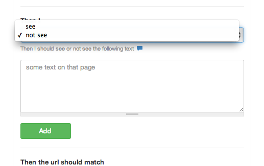
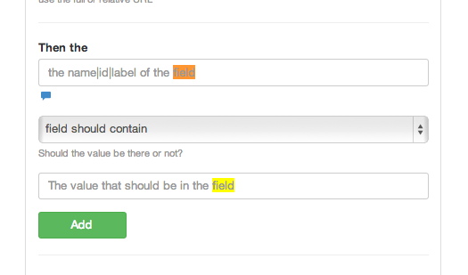

## Should or Should not see



This is to find text on a page. Keep in mind some text might not be text or not be as you see it.
For example you may have 
```html
<h1>hello</h1> there
```

And you are trying to see "hello there"
it may not work. So always check the source.

Also for input fields use the 



And for elements like classes etc check

*Then I see this element exists*

