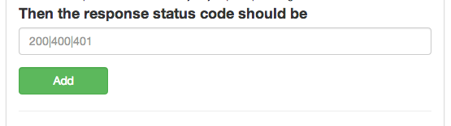

##Status Code

You can use this test to check the final outcome of the page.
For example it may be a download link but testing a download is hard.
But testing status code 200 would let you know it was a success.
