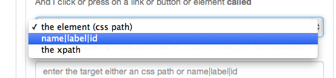
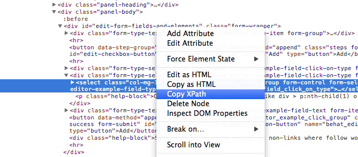

##Targets

You will often see a select list like this one

***
#####Element (css path)

For example 

	div.test > a.test_link 
	
would target that css path

#####Name|Label|ID

If you are lucky to be working with good HTML you can use just the name or label or ID of the link to follow or press. Keep in mind if you use the link text eg "Click Here" that it is not repeated on the page as a link.

#####Xpath

Finally you can always use Xpath but keep in mind to replace quotes with single quotes. So

	//*[@id="edit-behat-editor-example-field-type"]
	
Would become

	//*[@id='edit-behat-editor-example-field-type']

***

### You can see an example here from Chrome

