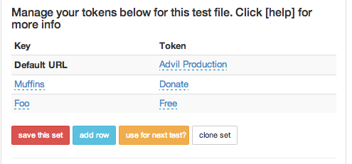

## Tokens

This will allow you to use one set of goals for domain 1 for domain 2

For example JanRain log in maybe the same for all sites but a different language.

Site 1 would use this token set

'Click Submit': 'lorem impsum'

Site 2 would use this token set
'Click Submit': 'foo bar foo'

When the domain URL is chosen to run the test then this token set will be used.
Or you can click the "use this test?" button as well.

### Here is the list of steps that allow for tokens

**you need to use the ace=true editor to get to these in the website**

prefix each row as needed with And or When or Given or Then

  * I go to the page "ARG"
  * I follow the link "ARG"
  * I press the "ARG" button
  * I click the "ARG"
  * I fill in the "ARG" field with "ARG"
  * I should see "ARG" on the page
  * I select "ARG" from the "ARG" selector
  * I additionally select "ARG" from the "ARG" selector
  * I check the "ARG" checkbox
  * I uncheck the "ARG" checkbox
  * Then the "ARG" form field should contain "ARG"
  * Then the "ARG" form field should not contain "ARG"
  * Then the "ARG" should be checked
  * I hover over "ARG"
  * I focus on the "ARG" iframe
  * I refocus on the primary page
  * I should see "ARG" components
  * I should not see "ARG" components"
  * I wait for the "ARG" component to (dis\)appear
  * The "ARG" should contain "ARG"
  * The "ARG" should not contain "ARG"

### Video 
[Tokens Video](http://www.youtube.com/watch?v=o2-YGlTHh-Q&feature=youtu.be)
