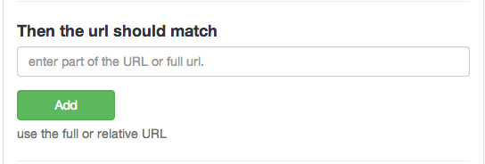

##URL Check

This is a great way to check if the URL is what you expected.

Right now it only checks the path of the url after the domain.

So if it was

	http://example.org/test

You could use it to check for

	/test
	

