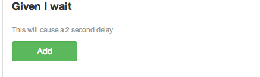

## Waits

This will cause a 3 second delay for the next step. This can help if you are waiting for a page to load or for other transition.

If you need more control over the wait time then use this one.
